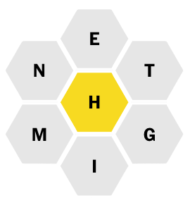

# nyt-spelling-bee

The New York Times Spelling Bee puzzle requires users to create words using only the specified letters. Each word must use the letter in the center of the puzzle at least once. Each word can use these letters multiple times, but it can only contain these seven letters.




## Create a dictionary

The resulting dictionary is already included in this repo, but the `build-dictionary.ps1` script can be used to create a dictionary that meets the following criterea:
1. Open source. The dictionary here is sourced from words found in the Online Plain Text English Dictionary (OPTED) found on [kaggle](https://www.kaggle.com/datasets/dfydata/the-online-plain-text-english-dictionary-opted).
1. Each word in the dictionary is a miniumum of four characters long since the NYT puzzle requires answers to be at least four characters.
1. Each word in the dictionary has a maximum of seven unique characters. Each day's NYT puzzle specifies seven unique characters, so no words with more than seven unique characters could ever be an answer for this puzzle.

## Locate matching words

The script `get-matching-words.ps1` will find all words that can be created with some or all of the seven specified letters. **The dictionary used in this repo does not exactly match the NYT dictionary, so some words will not be valid.**

The center letter of the puzzle is required for every word and is therefore specified separately as shown:

```
get-matching-words.ps1 -Center H -Outer NETGIM
```

The output will be grouped by word length since more points are awarded for longer words. The output of the script would look something like the **truncated** output below.

```
Words with 9 characters:
EIGHTIETH
ENGINEMEN
NIGHTTIME
NINETIETH

Words with 10 characters:
EIGHTEENTH
NINETEENTH
TIGHTENING
TITHINGMEN
```

The output will also include any **panagrams** detected. A panagram is a word that contains all seven of the letters in the puzzle.
